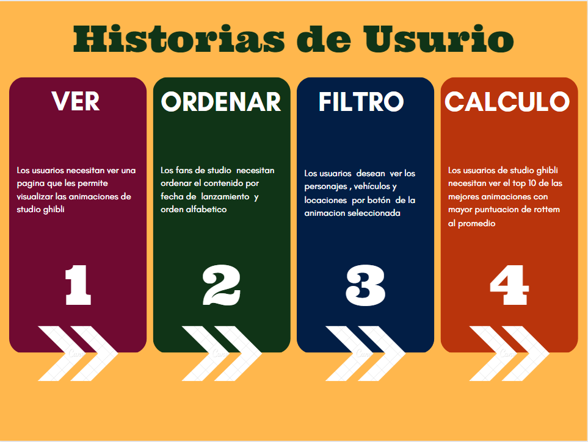
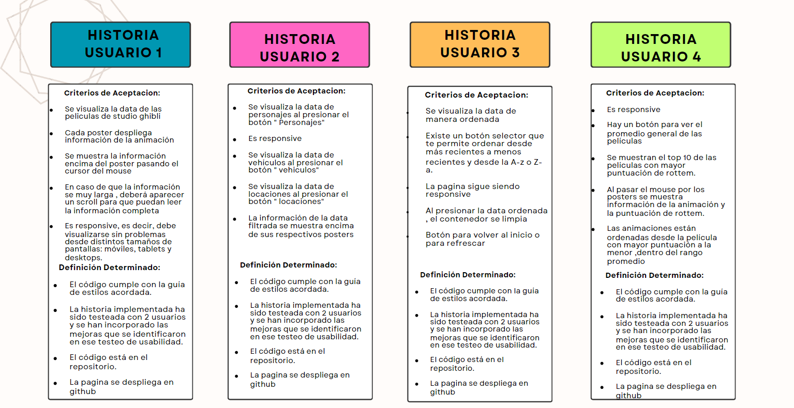
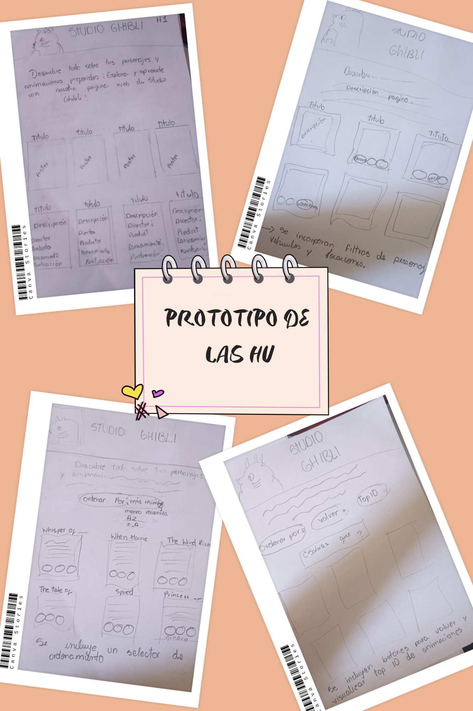
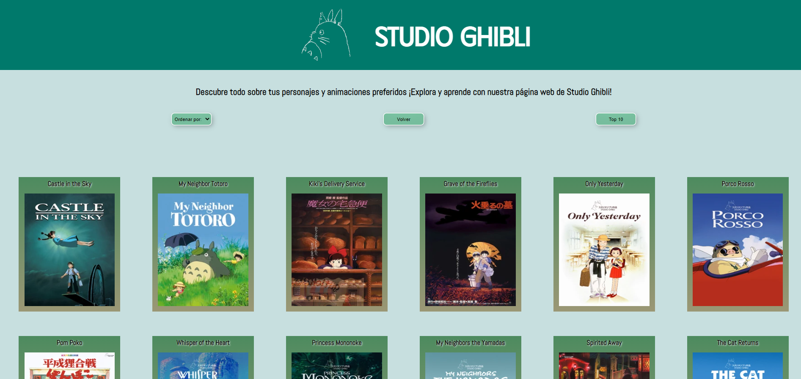
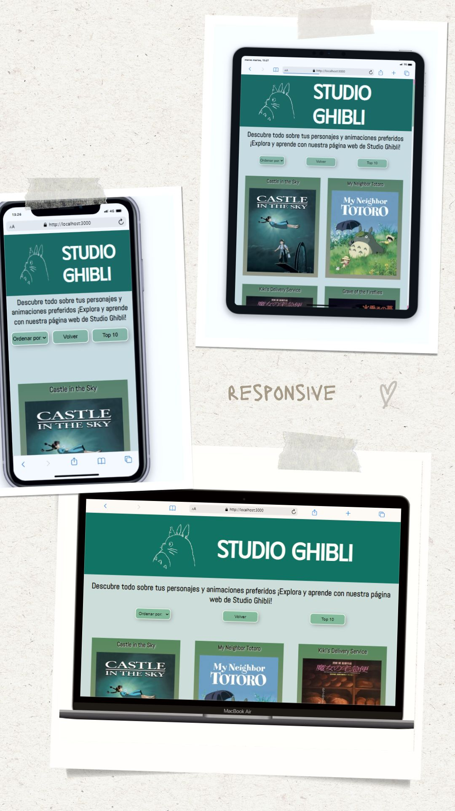

# Studio Ghibli

## Descripción
La pagina de Studio ghibli se ha creado con la finalidad de proporcionar información detallada y actualizada sobre sus  animaciones .Esto será beneficioso tanto para los fanáticos de la animación como para los investigadores y críticos de cine.interesados en conocer más sobre la obra de esta casa productora.
La pagina es dinamica y te permite:

1) Mostrar información sobre las animaciones de Studio Ghibli y sus personajes, como el título, el director, el productor, la fecha de lanzamiento, la puntuación de Rotten Tomatoes e información sobre los personajes, como sus nombres, edad, género y especie.

2) Mostrar las 10 mejores animaciones de Studio Ghibli según su puntuación en Rotten Tomatoes, un botón para mostrar los personajes de cada animación y botones para mostrar ubicaciones y vehículos relacionados con cada animación.

3) Calcular y muestrar la puntuación media de Rotten Tomatoes de todas las animaciones de Studio Ghibli.

En general, la pagina web  proporciona una interfaz para que los usuarios exploren y aprendan sobre las animaciones de Studio Ghibli y sus personajes, ubicaciones y vehículos relacionados.

## 1. Historias de Usuario
Primeras versiones de las historias de usuario que diseñamos en cada sprint 

 

## 2. Criterios de aceptacion y determinado

 

## 3. Prototipos de baja fidelidad

 

## 4. Prototipo de alta 

     

### 5. Implementación de la Interfaz de Usuario (HTML/CSS/JS)

     

## 6. Resumen del proyecto
<h3>Objetivos:</h3>
Este es un proyecto que tiene como objetivo mostrar información sobre películas del Studio Ghibli. A continuación, se detallan las funciones disponibles en el proyecto. 
<h3>Funciones</h3> 
<strong>filterOfdata(data, id)</strong>
Esta función filtra la información de las películas y devuelve un objeto con el título y los personajes de la película que corresponde con el id proporcionado.

<strong>filterOfdata2(data, id)</strong> 
Esta función filtra la información de las películas y devuelve un array con los vehículos de la película que corresponde con el id proporcionado.

<strong>filterOfdata3(data, id)</strong> 
Esta función filtra la información de las películas y devuelve un array con las locaciones de la película que corresponde con el id proporcionado.

<strong> sortData(data)</strong> 
Esta función ordena la información de las películas por fecha de lanzamiento, de más reciente a más antigua.

<strong> sortData2(data)</strong> 
Esta función ordena la información de las películas alfabéticamente por título, de la A a la Z.

<strong> sortData3(data)</strong> 
Esta función ordena la información de las películas por fecha de lanzamiento, de más antigua a más reciente.

<strong> sortData4(data)</strong> 
Esta función ordena la información de las películas alfabéticamente por título, de la Z a la A.

<strong> calculoData(data)</strong> 
Esta función calcula el promedio de las calificaciones (rt_score) de todas las películas.

<strong> filterMoviesByScore(data, topScore)</strong> 
Esta función filtra las películas por una puntuación mínima (topScore) y devuelve un array con las 10 películas con las puntuaciones más altas, ordenadas de mayor a menor.

## 7. Proyecto:

https://kellyfabiolafc.github.io/DEV004-data-lovers/src/

## 8. Contribuidores
<strong>Kelly  Flores<em>(floresdelacruzkellyfabiola@gmail.com)</em></strong> 
<strong>Alexa Suarez<em>(alexas1903@gmail.com)</em></strong>

## 9. Pruebas unitarias

<h3>Uso:</h3> 
La primera prueba es verificar si la filterOfdatafunción devuelve correctamente el título y los personajes de una película con una identificación específica. 
La segunda prueba es verificar si la filterOfdata2función devuelve correctamente los vehículos de una película con una identificación específica. 
La tercera prueba es verificar si la filterOfdata3función devuelve correctamente las ubicaciones de una película con una identificación específica. 
La cuarta prueba es verificar si la sortDatafunción clasifica correctamente una serie de objetos de películas en orden ascendente y descendente por fecha de lanzamiento. 
La quinta prueba es verificar si la sortData2función clasifica correctamente una matriz de objetos de película en orden ascendente por título. 
La sexta prueba es verificar si la sortData3función clasifica correctamente una serie de objetos de películas en orden ascendente y descendente por fecha de lanzamiento. 
La séptima prueba es verificar si la sortData4función clasifica correctamente una matriz de objetos de película en orden descendente por título. 
La octava prueba es comprobar si la calculoDatafunción calcula correctamente la puntuación media de todas las películas. 
La novena prueba está verificando que la función filterMoviesByScore filtre correctamente las películas que superan el promedio general y devuelva un nuevo arreglo con estas películas.

## 9. Objetivos de aprendizaje

Reflexiona y luego marca los objetivos que has llegado a entender y aplicar en tu proyecto. Piensa en eso al decidir tu estrategia de trabajo.

### HTML

- [ ] **Uso de HTML semántico**

  

Links

  * [HTML semántico](https://curriculum.laboratoria.la/es/topics/html/02-html5/02-semantic-html)
  * [Semantics - MDN Web Docs Glossary](https://developer.mozilla.org/en-US/docs/Glossary/Semantics#Semantics_in_HTML)

### CSS

- [ ] **Uso de selectores de CSS**

  

Links

  * [Intro a CSS](https://curriculum.laboratoria.la/es/topics/css/01-css/01-intro-css)
  * [CSS Selectors - MDN](https://developer.mozilla.org/es/docs/Web/CSS/CSS_Selectors)

- [ ] **Modelo de caja (box model): borde, margen, padding**

  

Links

  * [Box Model & Display](https://curriculum.laboratoria.la/es/topics/css/01-css/02-boxmodel-and-display)
  * [The box model - MDN](https://developer.mozilla.org/en-US/docs/Learn/CSS/Building_blocks/The_box_model)
  * [Introduction to the CSS box model - MDN](https://developer.mozilla.org/en-US/docs/Web/CSS/CSS_Box_Model/Introduction_to_the_CSS_box_model)
  * [CSS display - MDN](https://developer.mozilla.org/pt-BR/docs/Web/CSS/display)
  * [display - CSS Tricks](https://css-tricks.com/almanac/properties/d/display/)

- [ ] **Uso de flexbox en CSS**

  

Links

  * [A Complete Guide to Flexbox - CSS Tricks](https://css-tricks.com/snippets/css/a-guide-to-flexbox/)
  * [Flexbox Froggy](https://flexboxfroggy.com/#es)
  * [Flexbox - MDN](https://developer.mozilla.org/en-US/docs/Learn/CSS/CSS_layout/Flexbox)

### Web APIs

- [ ] **Uso de selectores del DOM**

  

Links

  * [Manipulación del DOM](https://curriculum.laboratoria.la/es/topics/browser/02-dom/03-1-dom-methods-selection)
  * [Introducción al DOM - MDN](https://developer.mozilla.org/es/docs/Web/API/Document_Object_Model/Introduction)
  * [Localizando elementos DOM usando selectores - MDN](https://developer.mozilla.org/es/docs/Web/API/Document_object_model/Locating_DOM_elements_using_selectors)

- [ ] **Manejo de eventos del DOM (listeners, propagación, delegación)**

  

Links

  * [Introducción a eventos - MDN](https://developer.mozilla.org/es/docs/Learn/JavaScript/Building_blocks/Events)
  * [EventTarget.addEventListener() - MDN](https://developer.mozilla.org/es/docs/Web/API/EventTarget/addEventListener)
  * [EventTarget.removeEventListener() - MDN](https://developer.mozilla.org/es/docs/Web/API/EventTarget/removeEventListener)
  * [El objeto Event](https://developer.mozilla.org/es/docs/Web/API/Event)

- [ ] **Manipulación dinámica del DOM**

  

Links

  * [Introducción al DOM](https://developer.mozilla.org/es/docs/Web/API/Document_Object_Model/Introduction)
  * [Node.appendChild() - MDN](https://developer.mozilla.org/es/docs/Web/API/Node/appendChild)
  * [Document.createElement() - MDN](https://developer.mozilla.org/es/docs/Web/API/Document/createElement)
  * [Document.createTextNode()](https://developer.mozilla.org/es/docs/Web/API/Document/createTextNode)
  * [Element.innerHTML - MDN](https://developer.mozilla.org/es/docs/Web/API/Element/innerHTML)
  * [Node.textContent - MDN](https://developer.mozilla.org/es/docs/Web/API/Node/textContent)

### JavaScript

- [ ] **Diferenciar entre tipos de datos primitivos y no primitivos**

- [ ] **Arrays (arreglos)**

  

Links

  * [Arreglos](https://curriculum.laboratoria.la/es/topics/javascript/04-arrays)
  * [Array - MDN](https://developer.mozilla.org/es/docs/Web/JavaScript/Reference/Global_Objects/Array/)
  * [Array.prototype.sort() - MDN](https://developer.mozilla.org/es/docs/Web/JavaScript/Reference/Global_Objects/Array/sort)
  * [Array.prototype.forEach() - MDN](https://developer.mozilla.org/es/docs/Web/JavaScript/Reference/Global_Objects/Array/forEach)
  * [Array.prototype.map() - MDN](https://developer.mozilla.org/es/docs/Web/JavaScript/Reference/Global_Objects/Array/map)
  * [Array.prototype.filter() - MDN](https://developer.mozilla.org/es/docs/Web/JavaScript/Reference/Global_Objects/Array/filter)
  * [Array.prototype.reduce() - MDN](https://developer.mozilla.org/es/docs/Web/JavaScript/Reference/Global_Objects/Array/Reduce)

- [ ] **Objetos (key, value)**

  

Links

  * [Objetos en JavaScript](https://curriculum.laboratoria.la/es/topics/javascript/05-objects/01-objects)

- [ ] **Variables (declaración, asignación, ámbito)**

  

Links

  * [Valores, tipos de datos y operadores](https://curriculum.laboratoria.la/es/topics/javascript/01-basics/01-values-variables-and-types)
  * [Variables](https://curriculum.laboratoria.la/es/topics/javascript/01-basics/02-variables)

- [ ] **Uso de condicionales (if-else, switch, operador ternario, lógica booleana)**

  

Links

  * [Estructuras condicionales y repetitivas](https://curriculum.laboratoria.la/es/topics/javascript/02-flow-control/01-conditionals-and-loops)
  * [Tomando decisiones en tu código — condicionales - MDN](https://developer.mozilla.org/es/docs/Learn/JavaScript/Building_blocks/conditionals)

- [ ] **Uso de bucles/ciclos (while, for, for..of)**

  

Links

  * [Bucles (Loops)](https://curriculum.laboratoria.la/es/topics/javascript/02-flow-control/02-loops)
  * [Bucles e iteración - MDN](https://developer.mozilla.org/es/docs/Web/JavaScript/Guide/Loops_and_iteration)

- [ ] **Funciones (params, args, return)**

  

Links

  * [Funciones (control de flujo)](https://curriculum.laboratoria.la/es/topics/javascript/02-flow-control/03-functions)
  * [Funciones clásicas](https://curriculum.laboratoria.la/es/topics/javascript/03-functions/01-classic)
  * [Arrow Functions](https://curriculum.laboratoria.la/es/topics/javascript/03-functions/02-arrow)
  * [Funciones — bloques de código reutilizables - MDN](https://developer.mozilla.org/es/docs/Learn/JavaScript/Building_blocks/Functions)

- [ ] **Pruebas unitarias (unit tests)**

  

Links

  * [Empezando con Jest - Documentación oficial](https://jestjs.io/docs/es-ES/getting-started)

- [ ] **Módulos de ECMAScript (ES Modules)**

  

Links

  * [import - MDN](https://developer.mozilla.org/es/docs/Web/JavaScript/Reference/Statements/import)
  * [export - MDN](https://developer.mozilla.org/es/docs/Web/JavaScript/Reference/Statements/export)

- [ ] **Uso de linter (ESLINT)**

- [ ] **Uso de identificadores descriptivos (Nomenclatura y Semántica)**

- [ ] **Diferenciar entre expresiones (expressions) y sentencias (statements)**

### Control de Versiones (Git y GitHub)

- [ ] **Git: Instalación y configuración**

- [ ] **Git: Control de versiones con git (init, clone, add, commit, status, push, pull, remote)**

- [ ] **Git: Integración de cambios entre ramas (branch, checkout, fetch, merge, reset, rebase, tag)**

- [ ] **GitHub: Creación de cuenta y repos, configuración de llaves SSH**

- [ ] **GitHub: Despliegue con GitHub Pages**

  

Links

  * [Sitio oficial de GitHub Pages](https://pages.github.com/)

- [ ] **GitHub: Colaboración en Github (branches | forks | pull requests | code review | tags)**

### Centrado en el usuario

- [ ] **Diseñar y desarrollar un producto o servicio poniendo a las usuarias en el centro**

### Diseño de producto

- [ ] **Crear prototipos de alta fidelidad que incluyan interacciones**

- [ ] **[Seguir los principios básicos de diseño visual](https://coda.io/d/Bootcamp-UX-Contenido_dqkqk2rV9Z2/Diseno-Visual_suOT7#_luWsQ)**

### Investigación

- [ ] **Planear y ejecutar testeos de usabilidad de prototipos en distintos niveles de fidelidad**

  

Links

  * [Intro a testeos usabilidad](https://coda.io/@bootcamp-laboratoria/contenido-ux/test-de-usabilidad-15)
  * [Pruebas con Usuarios 1 — ¿Qué, cuándo y para qué testeamos?](https://eugeniacasabona.medium.com/pruebas-con-usuarios-1-qu%C3%A9-cu%C3%A1ndo-y-para-qu%C3%A9-testeamos-7c3a89b4b5e7)

### Checklist

* [ ] Usa VanillaJS.
* [ ] Pasa linter (`npm run pretest`)
* [ ] Pasa tests (`npm test`)
* [ ] Pruebas unitarias cubren un mínimo del 70% de statements, functions y
  lines y branches.
* [ ] Incluye _Definición del producto_ clara e informativa en `README.md`.
* [ ] Incluye historias de usuario en `README.md`.
* [ ] Incluye _sketch_ de la solución (prototipo de baja fidelidad) en
  `README.md`.
* [ ] Incluye _Diseño de la Interfaz de Usuario_ (prototipo de alta fidelidad)
  en `README.md`.
* [ ] Incluye el listado de problemas que detectaste a través de tests de
  usabilidad en el `README.md`.
* [ ] UI: Muestra lista y/o tabla con datos y/o indicadores.
* [ ] UI: Permite ordenar data por uno o más campos (asc y desc).
* [ ] UI: Permite filtrar data en base a una condición.
* [ ] UI: Es _responsive_.

#### Desarrollo Front-end

* Unidad de testing en curso de JavaScript en LMS.
* Unidad de arreglos en curso de JavaScript en LMS.
* Unidad de objetos en curso de JavaScript en LMS.
* Unidad de funciones en curso de JavaScript en LMS.
* Unidad de DOM en curso de Browser JavaScript en LMS.
* [Array en MDN](https://developer.mozilla.org/es/docs/Web/JavaScript/Referencia/Objetos_globales/Array)
* [Array.sort en MDN](https://developer.mozilla.org/es/docs/Web/JavaScript/Referencia/Objetos_globales/Array/sort)
* [Array.map en MDN](https://developer.mozilla.org/es/docs/Web/JavaScript/Referencia/Objetos_globales/Array/map)
* [Array.filter en MDN](https://developer.mozilla.org/es/docs/Web/JavaScript/Referencia/Objetos_globales/Array/filter)
* [Array.reduce en MDN](https://developer.mozilla.org/es/docs/Web/JavaScript/Referencia/Objetos_globales/Array/reduce)
* [Array.forEach en MDN](https://developer.mozilla.org/es/docs/Web/JavaScript/Referencia/Objetos_globales/Array/forEach)
* [Object.keys en MDN](https://developer.mozilla.org/es/docs/Web/JavaScript/Referencia/Objetos_globales/Object/keys)
* [Object.entries en MDN](https://developer.mozilla.org/es/docs/Web/JavaScript/Referencia/Objetos_globales/Object/entries)
* [Fetch API en MDN](https://developer.mozilla.org/en-US/docs/Web/API/Fetch_API)
* [json.org](https://json.org/json-es.html)
* [expressions-vs-statements](https://2ality.com/2012/09/expressions-vs-statements.html)
* [expresión vs sentencia](https://openclassrooms.com/en/courses/4309531-descubre-las-funciones-en-javascript/5108986-diferencia-entre-expresion-y-sentencia)
* [datos atómicos vs datos estructurados](https://www.todojs.com/tipos-datos-javascript-es6/)
* [Modulos: Export](https://developer.mozilla.org/es/docs/Web/JavaScript/Referencia/Sentencias/export)
* [Modulos: Import](https://developer.mozilla.org/es/docs/Web/JavaScript/Referencia/Sentencias/import)

#### Herramientas

* [Git](https://git-scm.com/)
* [GitHub](https://github.com/)
* [GitHub Pages](https://pages.github.com/)
* [Node.js](https://nodejs.org/)
* [Jest](https://jestjs.io/)

#### Organización del Trabajo

* [Historias de Usuario](https://www.youtube.com/watch?v=ky6wFiF5vMk&t=344s).
  Ojo que Cris no diferencia _Definición de terminado_ de _Criterios de
  Aceptación_ y nosotros sí lo haremos. Más detalles en la guía.
* [Cómo dividir H.U.](https://www.youtube.com/watch?v=Ueq786iZ30I&t=341s)
* [Guía para Data Lovers](https://docs.google.com/presentation/d/e/2PACX-1vQhx9D36NjpH-Daea-ITPUDUzNL8ZiNAprq_7b5PSUrfutk45tEtaOLz2lmd8f54_5jX1hypDM8f8SM/pub?start=false&loop=false&delayms=60000)

